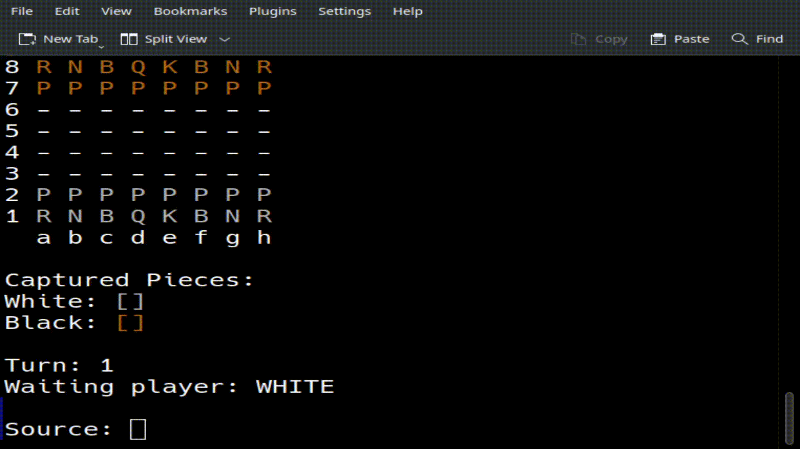

# Chess
## Chess game made in java to Practice OOP and System Design

 (this is an eclipse project, so you might need eclipse or some java ide to execute it)

 To play, simply execute application.Program.java, it should look like the Following example: 

## UML Diagram:

